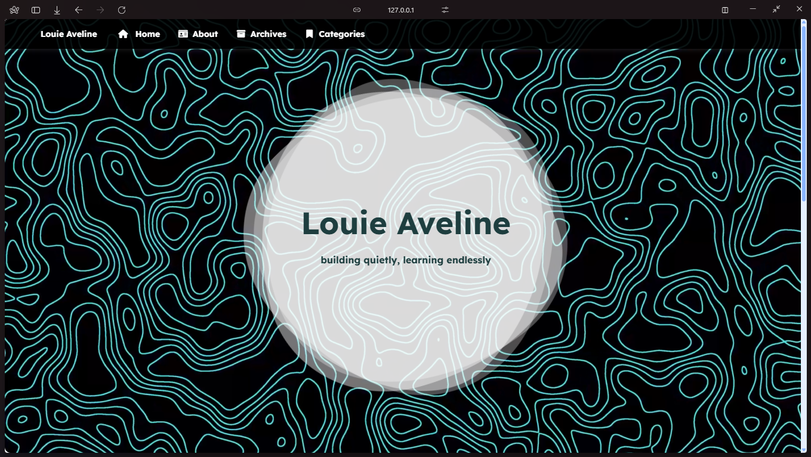

# Personal Website

This is the source code for my personal website, built to showcase my projects and share information. The site is structured for simplicity, accessibility, and ease of navigation.

## 📂 Project Structure

- `css/`: Contains all style sheets for the website.
- `js/`: JavaScript files responsible for dynamic features.
- `images/`: Visual assets used throughout the site.
- `about/`: Information about me and my background.
- `categories/personal-projects/`: A collection of my personal projects.
- `categories/other/`: Others posts.
- `index.html`: The main landing page of the website.

## 💡 Features

- Responsive design for all devices.
- Project showcase section.
- About page with personal information.
- Simple and clean layout.

## 📸 Preview

### Homepage

## 🛠️ Technologies Used

- HTML5
- CSS3
- JavaScript

## 🎖️ Credits

This website is based on:  
- [Hexo Engine](https://hexo.io/pt-br/)  
- [ParticleX Theme](https://github.com/theme-particlex/hexo-theme-particlex)  
- [Argvchs Blog](https://github.com/argvchs)

## 🔒 License

This project is licensed under the [MIT License](https://opensource.org/licenses/MIT).
